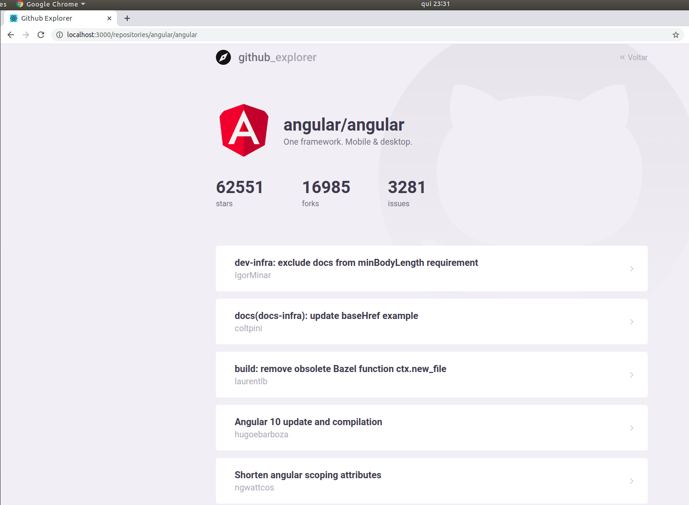

# GitHub Explorer
* Busca repositórios do github.
* Mostra os dados de stars, forks e issues de um repositório.
* Redireciona para as páginas de issues e pull requests do repositório.

## Excutando a aplicação
É necessário primeiramente executar o comando "yarn" para a instalação das dependências, e depois "yarn start" para executar a aplicação.

## Tecnologias usadas

* <a href="https://www.typescriptlang.org/">TypeScript</a>
* <a href="https://pt-br.reactjs.org/">React</a>
* <a href="https://eslint.org/">ESLint</a>
* <a href="https://prettier.io/">Prettier</a>
* <a href="https://github.com/axios/axios">Axios</a>
* <a href="https://styled-components.com/">Styled Components</a>

